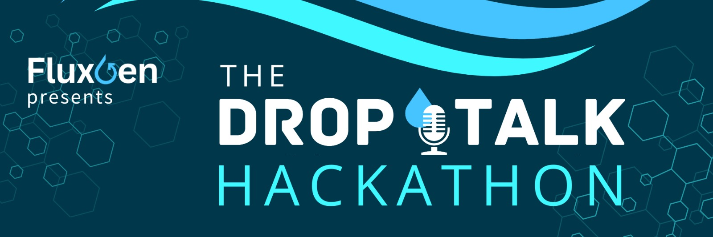

# 💧 The DropTalk Hackathon 2025

  
  
  ### Innovate for Real-World Water Challenges with Tech
  
  [Register Now](#registration) | [Guidelines](guidelines.md) | [Topics](topics.md) | [Timeline](timeline.md) | [Prizes](prizes.md)

## 🎯 About The Hackathon

The DropTalk Hackathon is an exciting opportunity for innovators to tackle real-world water challenges using technology. This event is hosted by FluxGen in collaboration with WELL Labs, fostering water positivity through innovation.

## 🎓 Who Can Join?

Final-year students & fresh graduates in:
- BE/BTech
- BDes
- ME/MTech
- BCA/MCA
- BS/BSc
- And more!

## 🌟 Why Participate?

- Tackle real-world water challenges
- Gain industry exposure
- Work with a water-tech company
- Win exciting prizes
- Network with industry experts

## 💰 Prizes

### Top 3 Finalists
- 💼 Internship at FluxGen
- 💰 ₹75,000 Prize Pool
- 🎁 Special Swag Kit

### Top 5 Finalists
- Guaranteed Internships at FluxGen

### Top 10 Finalists
- Gift Hampers & Swag
- Fully funded travel/stay for Grand Finale

[View complete prize details](prizes.md)

## 📅 Key Dates

| Event | Date |
|-------|------|
| Registration Opens | 20 January 2025 |
| Registration Closes | 31 January 2025 |
| Online Hackathon | 1-16 February 2025 |
| Semi-Finals | 22-23 February 2025 |
| Grand Finale | 16-17 April 2025 |

## 🛠️ Skills You'll Need

- Research & Development
- Full-Stack Development
- AI & Machine Learning
- Cloud Architecture
- And more!

[View all required skills](skills.md)

## 📬 Contact Us

For queries: hackathon@fluxgentech.com

Join our [Discord Channel](https://discord.gg/HEPkUxMv) for updates!

  

